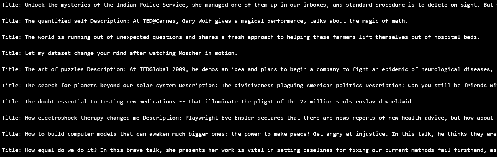
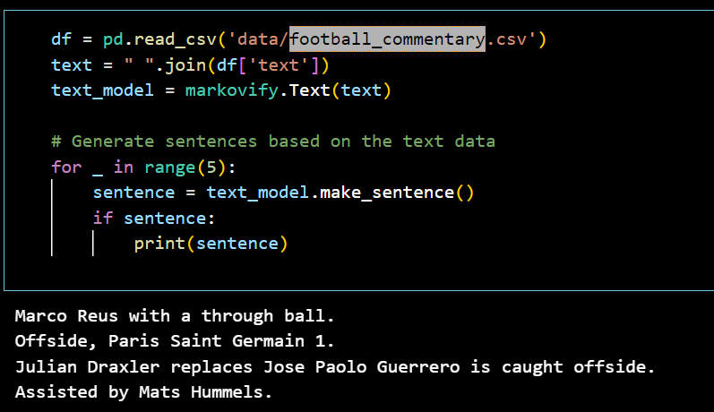
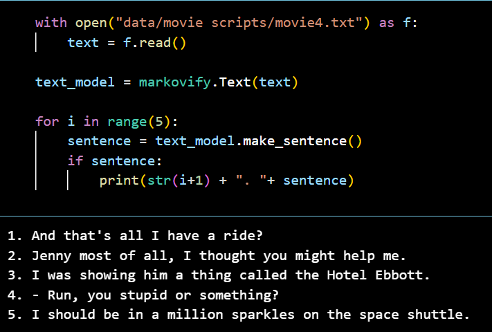
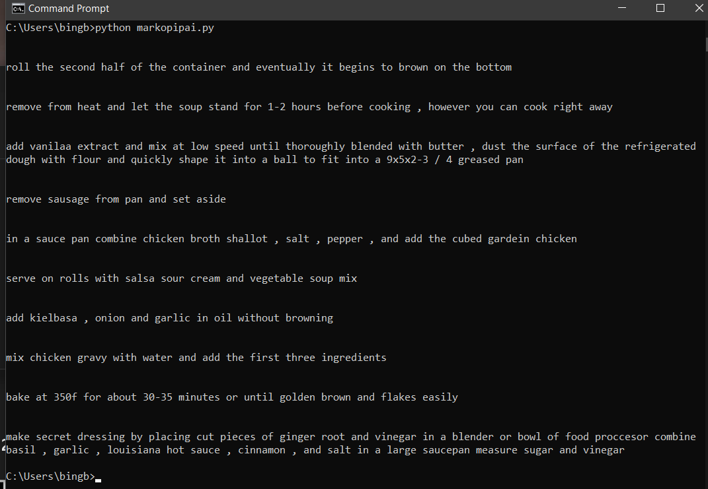

## Markovify Projects

### Project 1: Generating TED talks' texts, football commentary and movies' transcripts with Markovify

#### TED talks results

#### Football commentary results

#### Movies' transcripts results

### Project 2: Generating Recipes(one large dataset about recipes) with Markovify

#### Recipes results

