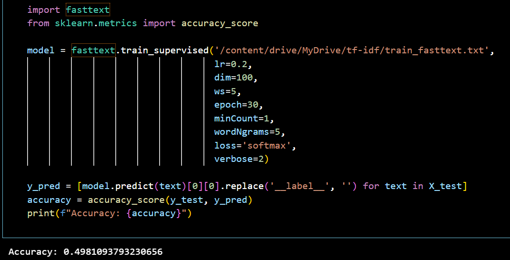
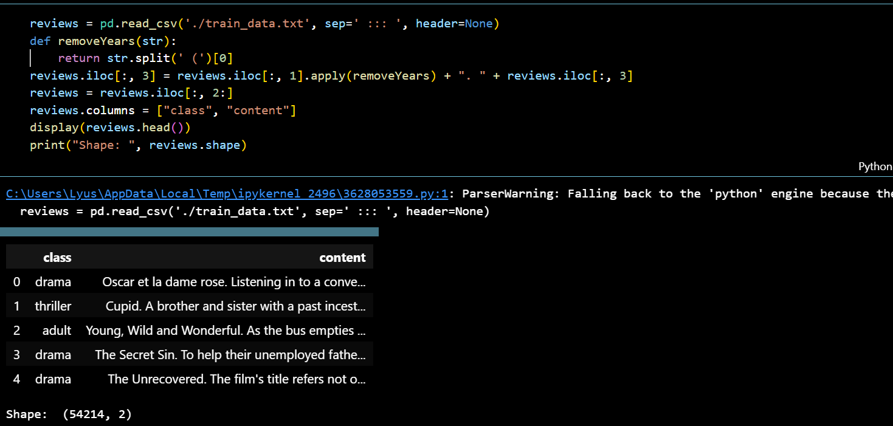
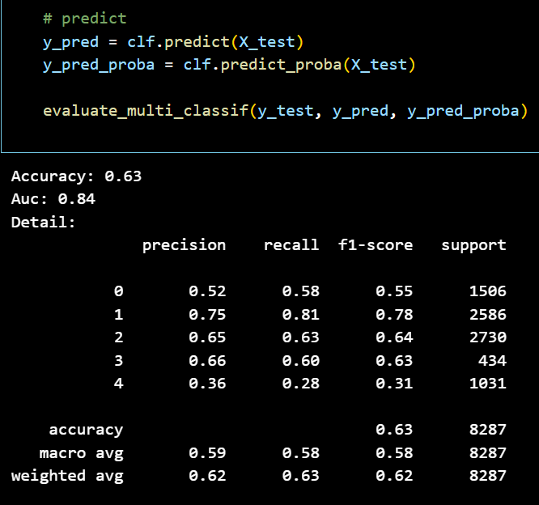
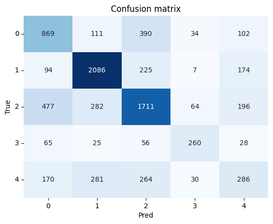
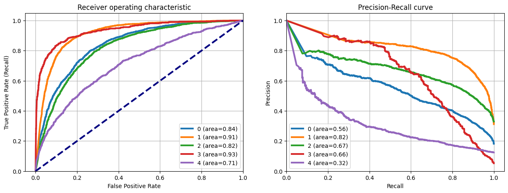
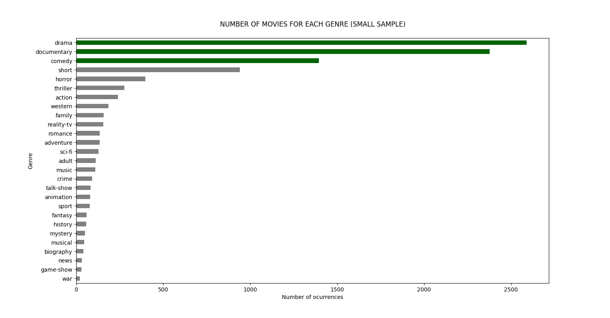
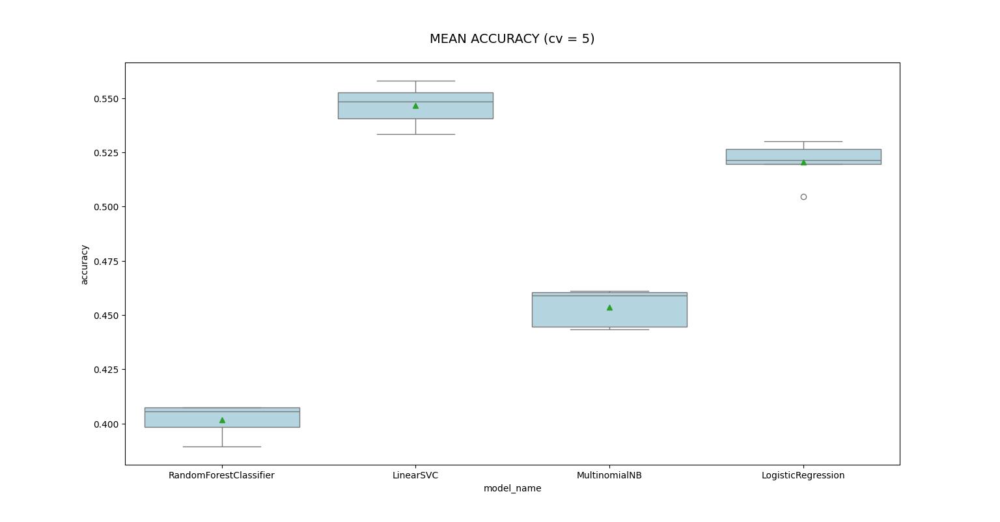
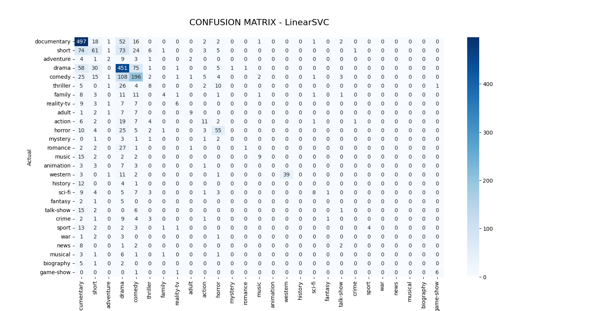

## Movie Reviews Classification

### Classification 01

#### Data Preprocessing

#### Accuracy

### Classification 02

#### Accuracy

#### Confusion Matrix

#### ROC and Precision-Recall Curve

### Classification 03

#### (10000 samples) Number of occurence

#### (10000 samples) Mean accuracy

#### (10000 samples) Confusion matrix

#### (15000 samples) Number of occurence

.png)

#### (15000 samples) Mean accuracy

.png)

#### (15000 samples) Confusion matrix

.png)

#### (20000 samples) Number of occurence

.png)

#### (20000 samples) Mean accuracy

.png)

#### (20000 samples) Confusion matrix

.png)